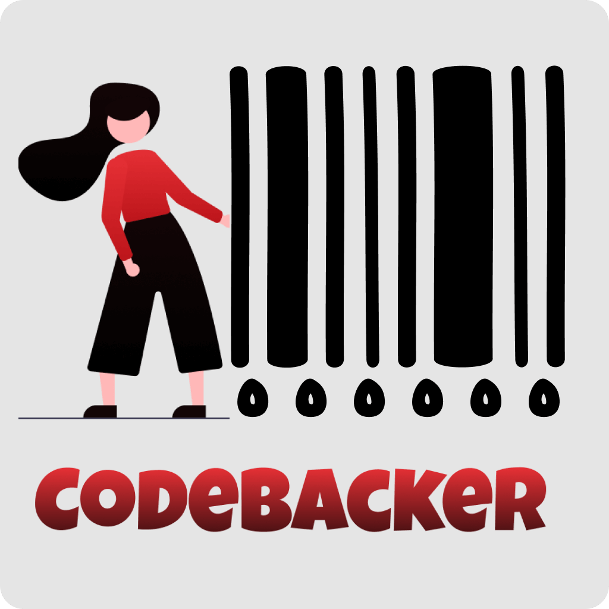
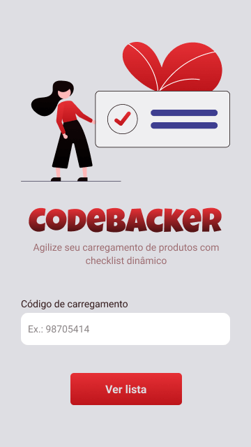

<h1 align="center">
        
    Node.js | React Native | Expo
</h1>

  
   
    

 

  

## :bookmark: About

In the company I am currently working in, there is a certain sector that is responsible for loading packages into vehicles. 
These packages have a bar code to determine the destination of the package and the vehicle also has a bar code to verify that 
a certain package must be with a specific vehicle.

The problem is that the bar codes are very large and similar and sometimes the people in charge of the packages ended up 
sending it wrong or forgetting some packages, to get around the situation, my superior (in which he provided the query to the 
company's internal Oracle database) and I developed this project to reduce the chances of errors in loading and unloading 
these packages.

 

## :eyes: Preview

  
  

 

## :computer: Technologies Used

This project is still in constant development, currently it is in an experimental phase where strengths and weaknesses will
be raised for its completion. Among the technologies used are:
 

- [Node.js](https://nodejs.org/en/)
- [React Native](https://reactnative.dev/)
- [Figma](https://www.figma.com/)
- [Express](https://expressjs.com/pt-br/)
- [ESLint](https://eslint.org/)
- [Prettier](https://prettier.io/)
- [Expo](https://expo.io/)
- [ExpoCodebarScanner](https://docs.expo.io/versions/latest/sdk/bar-code-scanner/)
- [AsyncStorage](https://reactnative.dev/docs/asyncstorage)

 

## :sparkles: Website prototype
The prototype of the App was developed on the figma platform, a free and completely online platform for developing interface prototypes. To see the prototype
just acess [the link to figma project](https://www.figma.com/file/o7Q4xfjZJksSrpFDbCmmhM/Codebacker?node-id=86%3A0) and enjoy it.

 

## :memo: License

this project is under mit [MIT license ](LICENSE) for more details
   

## :wave: Social

Follow me on my [Instagram](https://www.instagram.com/edvaldo_junior_dev/) and let's talk a little :wink:
